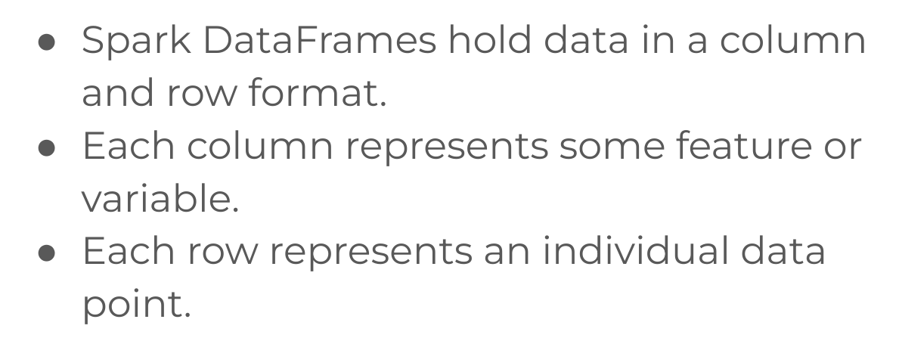
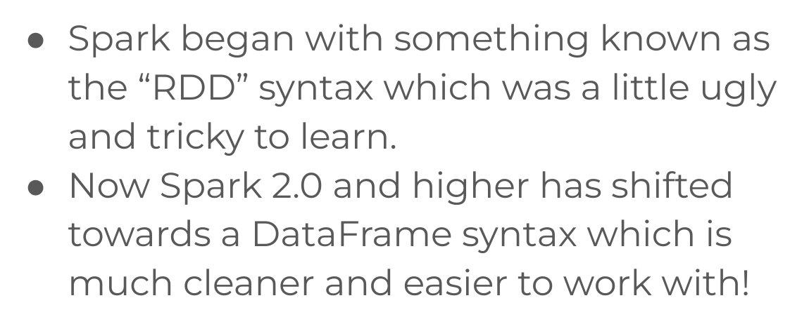
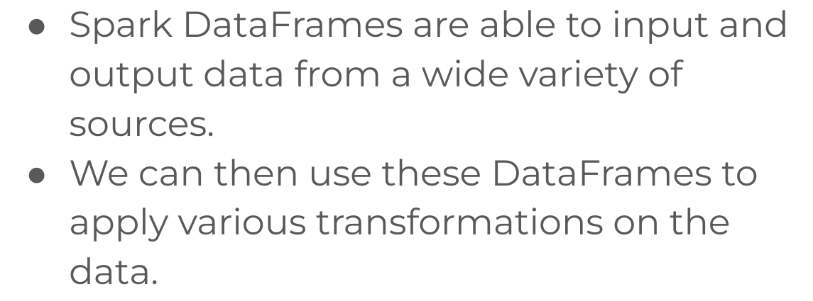
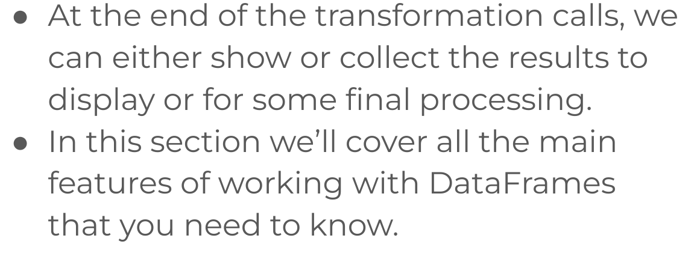
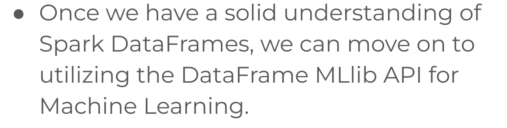
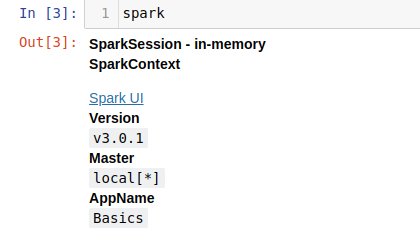
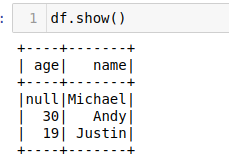
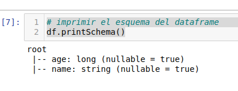
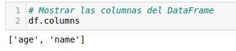

# 2.- Spark DataFrame Basics


1. [Introduction to Spark DataFrames](#schema1)
2. [Spark DataFrames Basics](#schema2)
3. [Spark SQL](#schema3)
4. [Spark DataFrame Basic Operations](#schema4)
5. [Groupb y and Aggregate Operations](#schema5)
6. [Missing Data](#schema6)
7. [Dates and Timestamp](#schema7)


<hr>

<a name="schema1"></a>

## 1. Introduction to Spark DataFrames












<hr>

<a name="schema2"></a>

## 2. Spark DataFrames Basics
- Crear la sesion
```
from pyspark.sql import SparkSession
spark = SparkSession.builder.appName('Basics').getOrCreate()
spark
```


- Mostrar el DataFrame
```
df = spark.read.json('./data/people.json')
df.show()
```


- Imprimir el esquema del dataframe
``` 
df.printSchema()
```    



- Mostrar las columnas del DataFrame
```
df.columns
```


- Mostrar el resumen estadístico

```
df.describe().show()
``` 
```   

+-------+------------------+-------+
|summary|               age|   name|
+-------+------------------+-------+
|  count|                 2|      3|
|   mean|              24.5|   null|
| stddev|7.7781745930520225|   null|
|    min|                19|   Andy|
|    max|                30|Michael|
+-------+------------------+-------+

```

- Crear nuestro propio esqueme y cambiar los tipos de datos

```
from pyspark.sql.types import StructField, StringType, IntegerType,StructType
data_schema = [StructField('age',IntegerType(),True),
              StructField('name',StringType(),True)]
              
final_struc = StructType(fields = data_schema)
df.printSchema()
```
```
root
 |-- age: integer (nullable = true)
 |-- name: string (nullable = true)
```

- Saber el tipo de una columna
```
type(df['age'])
``` 
```
pyspark.sql.column.Column
```

```
df.select('age')
DataFrame[age: int]
```
- Mostrar el valor de una columnas
```
df.select('age').show()
+----+
| age|
+----+
|null|
|  30|
|  19|
+----+
```
- Añadir un columna al DataFrame.
  -   Hay que tener en cuenta que no es una operación que modifique el df original.
```
 df.withColumn('newage',df['age']*2).show()
+----+-------+------+
| age|   name|newage|
+----+-------+------+
|null|Michael|  null|
|  30|   Andy|    60|
|  19| Justin|    38|
+----+-------+------+

```
 
- Cambiar el nombre de una columna
```
df.withColumnRenamed('age','new_age').show()
+-------+-------+
|new_age|   name|
+-------+-------+
|   null|Michael|
|     30|   Andy|
|     19| Justin|
+-------+-------+
```


<hr>

<a name="schema3"></a>

## 3. Spark SQL

Podemos usar las querys de SQL para obtener resultados de nuestro DF

```
df.createOrReplaceTempView('people')
results = spark.sql("SELECT * FROM people")
results.show()
+----+-------+
| age|   name|
+----+-------+
|null|Michael|
|  30|   Andy|
|  19| Justin|
+----+-------+

```

<hr>

<a name="schema4"></a>

## 4. Spark DataFrame Basic Operations

- Filtrar valores de Close menor que 500
```
df.filter("Close < 500").show()
+----------+------------------+------------------+------------------+------------------+---------+------------------+
|      Date|              Open|              High|               Low|             Close|   Volume|         Adj Close|
+----------+------------------+------------------+------------------+------------------+---------+------------------+
|2010-01-04|        213.429998|        214.499996|212.38000099999996|        214.009998|123432400|         27.727039|
|2010-01-05|        214.599998|        215.589994|        213.249994|        214.379993|150476200|27.774976000000002|
|2010-01-06|        214.379993|            215.23|        210.750004|        210.969995|138040000|27.333178000000004|
|2010-01-07|            211.75|        212.000006|        209.050005|            210.58|119282800|          27.28265|
|2010-01-08|        210.299994|        212.000006|209.06000500000002|211.98000499999998|111902700|         27.464034|
|2010-01-11|212.79999700000002|        213.000002|        208.450005|210.11000299999998|115557400|         27.221758|
|2010-01-12|209.18999499999998|209.76999500000002|        206.419998|        207.720001|148614900|          26.91211|
|2010-01-13|        207.870005|210.92999500000002|        204.099998|        210.650002|151473000|          27.29172|
|2010-01-14|210.11000299999998|210.45999700000002|        209.020004|            209.43|108223500|         27.133657|
|2010-01-15|210.92999500000002|211.59999700000003|        205.869999|            205.93|148516900|26.680197999999997|
|2010-01-19|        208.330002|215.18999900000003|        207.240004|        215.039995|182501900|27.860484999999997|
|2010-01-20|        214.910006|        215.549994|        209.500002|            211.73|153038200|         27.431644|
|2010-01-21|        212.079994|213.30999599999998|        207.210003|        208.069996|152038600|         26.957455|
|2010-01-22|206.78000600000001|        207.499996|            197.16|            197.75|220441900|         25.620401|
|2010-01-25|202.51000200000001|        204.699999|        200.190002|        203.070002|266424900|26.309658000000002|
|2010-01-26|205.95000100000001|        213.710005|        202.580004|        205.940001|466777500|         26.681494|
|2010-01-27|        206.849995|            210.58|        199.530001|        207.880005|430642100|26.932840000000002|
|2010-01-28|        204.930004|        205.500004|        198.699995|        199.289995|293375600|25.819922000000002|
|2010-01-29|        201.079996|        202.199995|        190.250002|        192.060003|311488100|         24.883208|
|2010-02-01|192.36999699999998|             196.0|191.29999899999999|        194.729998|187469100|         25.229131|
+----------+------------------+------------------+------------------+------------------+---------+------------------+
only showing top 20 rows

```


- Filtrar valores de Close menor que 500 combinado con acciones de SQL
```
df.filter("Close < 500").show()
```
- Muestra solo la columna Open

```
df.filter("Close < 500").select('Open').show()
```

- Para mostrar varias Columnas le pasamos al select una lista de columnas.
```
df.filter("Close < 500").select(['Open','Close']).show()

+------------------+------------------+
|              Open|             Close|
+------------------+------------------+
|        213.429998|        214.009998|
|        214.599998|        214.379993|
|        214.379993|        210.969995|
|            211.75|            210.58|
|        210.299994|211.98000499999998|
|212.79999700000002|210.11000299999998|
|209.18999499999998|        207.720001|
|        207.870005|        210.650002|
|210.11000299999998|            209.43|
|210.92999500000002|            205.93|
|        208.330002|        215.039995|
|        214.910006|            211.73|
|        212.079994|        208.069996|
|206.78000600000001|            197.75|
|202.51000200000001|        203.070002|
|205.95000100000001|        205.940001|
|        206.849995|        207.880005|
|        204.930004|        199.289995|
|        201.079996|        192.060003|
|192.36999699999998|        194.729998|
+------------------+------------------+
only showing top 20 rows

```

- Otra manera
```
df.filter(df['Close']<500).select('Close').show()

+------------------+
|             Close|
+------------------+
|        214.009998|
|        214.379993|
|        210.969995|
|            210.58|
|211.98000499999998|
|210.11000299999998|
|        207.720001|
|        210.650002|
|            209.43|
|            205.93|
|        215.039995|
|            211.73|
|        208.069996|
|            197.75|
|        203.070002|
|        205.940001|
|        207.880005|
|        199.289995|
|        192.060003|
|        194.729998|
+------------------+
only showing top 20 rows
```

- Filter con dos condiciones, hay que separar cada condición con paréntesis
```
df.filter((df['Close']< 200) & (df['Open']>200)).show()

+----------+------------------+----------+----------+----------+---------+------------------+
|      Date|              Open|      High|       Low|     Close|   Volume|         Adj Close|
+----------+------------------+----------+----------+----------+---------+------------------+
|2010-01-22|206.78000600000001|207.499996|    197.16|    197.75|220441900|         25.620401|
|2010-01-28|        204.930004|205.500004|198.699995|199.289995|293375600|25.819922000000002|
|2010-01-29|        201.079996|202.199995|190.250002|192.060003|311488100|         24.883208|
+----------+------------------+----------+----------+----------+---------+------------------+
```
- Usando .collect() en vez de .show() obtenemos una lista con el valor
```
result = df.filter(df['Low'] ==197.16 ).collect()
result

[Row(Date='2010-01-22', Open=206.78000600000001, High=207.499996, Low=197.16, Close=197.75, Volume=220441900, Adj Close=25.620401)]
```
- Obtenemos el valor 0 de la lista para verlo como un diccionario
```
row = result[0]
row.asDict()

{'Date': '2010-01-22',
 'Open': 206.78000600000001,
 'High': 207.499996,
 'Low': 197.16,
 'Close': 197.75,
 'Volume': 220441900,
 'Adj Close': 25.620401}
```


<hr>

<a name="schema5"></a>

## 5. Groupby and Aggregate Operations

### groupBy

- Agrupa los valores por una columna y se le añada una función de agregación
```
df.groupBy('Company').mean().show()

+-------+-----------------+
|Company|       avg(Sales)|
+-------+-----------------+
|   APPL|            370.0|
|   GOOG|            220.0|
|     FB|            610.0|
|   MSFT|322.3333333333333|
+-------+-----------------+
```

### agg

Aplica una función de agregación a la columna seleccionada
```
df.agg({'Sales':'sum'}).show()

+----------+
|sum(Sales)|
+----------+
|    4327.0|
+----------+
```


### Functions
**pyspark.sql.functions**

Es un módulo en PySpark que proporciona un conjunto de funciones para realizar operaciones comunes en columnas 
de DataFrames. Estas funciones son similares a las funciones de SQL y pueden ser utilizadas para 
realizar transformaciones y cálculos en los datos de un DataFrame.

```
from pyspark.sql.functions import countDistinct, avg, stddev
df.select(countDistinct('Sales')).show()
+---------------------+
|count(DISTINCT Sales)|
+---------------------+
|                   11|
+---------------------+
```
- Podemos ponerle Alias a los datos generados
```
df.select(avg('Sales').alias('Average Sales')).show()

+-----------------+
|    Average Sales|
+-----------------+
|360.5833333333333|
+-----------------+

```
- Redondear un número por la cantidad de decimales, para eso necesitamos importar lo siguiente

```

from pyspark.sql.functions import format_number
sales_std = df.select(stddev('Sales').alias('std'))

sales_std.show()
+------------------+
|               std|
+------------------+
|250.08742410799007|
+------------------+

```

```
sales_std.select(format_number('std',2)).show()
+---------------------+
|format_number(std, 2)|
+---------------------+
|               250.09|
+---------------------+

sales_std.select(format_number('std',2).alias('std')).show()
+------+
|   std|
+------+
|250.09|
+------+

```

### orderBy
- Ordena por defecto de menor a mayor, de forma ascedente.
```

df.orderBy("Sales").show()
+-------+-------+-----+
|Company| Person|Sales|
+-------+-------+-----+
|   GOOG|Charlie|120.0|
|   MSFT|    Amy|124.0|
|   APPL|  Linda|130.0|
|   GOOG|    Sam|200.0|
|   MSFT|Vanessa|243.0|
|   APPL|   John|250.0|
|   GOOG|  Frank|340.0|
|     FB|  Sarah|350.0|
|   APPL|  Chris|350.0|
|   MSFT|   Tina|600.0|
|   APPL|   Mike|750.0|
|     FB|   Carl|870.0|
```

- Si lo queremos de forma decendente.

```

df.orderBy(df['Sales'].desc()).show()
+-------+-------+-----+
|Company| Person|Sales|
+-------+-------+-----+
|     FB|   Carl|870.0|
|   APPL|   Mike|750.0|
|   MSFT|   Tina|600.0|
|     FB|  Sarah|350.0|
|   APPL|  Chris|350.0|
|   GOOG|  Frank|340.0|
|   APPL|   John|250.0|
|   MSFT|Vanessa|243.0|
|   GOOG|    Sam|200.0|
|   APPL|  Linda|130.0|
|   MSFT|    Amy|124.0|
|   GOOG|Charlie|120.0|
+-------+-------+-----+

```


<hr>

<a name="schema6"></a>
## 6. Missing Data

### Borrar todos los nulos

```
df.na.drop().show()
+----+-----+-----+
|  Id| Name|Sales|
+----+-----+-----+
|emp4|Cindy|456.0|
+----+-----+-----+
```
- Especificando argumentos, threshold esto lo que hace la fila tiene que tener dos nulos para borrarla
```

df.na.drop(thresh=2).show()

+----+-----+-----+
|  Id| Name|Sales|
+----+-----+-----+
|emp1| John| null|
|emp3| null|345.0|
|emp4|Cindy|456.0|
+----+-----+-----+

```

-  **How**, any que tengo algún valor no nulo

```
df.na.drop(how ='any' ).show()
+----+-----+-----+
|  Id| Name|Sales|
+----+-----+-----+
|emp4|Cindy|456.0|
+----+-----+-----+

```

 - **all** que todos sus valores sean nulos
```
df.na.drop(how ='all' ).show()
+----+-----+-----+
|  Id| Name|Sales|
+----+-----+-----+
|emp1| John| null|
|emp2| null| null|
|emp3| null|345.0|
|emp4|Cindy|456.0|
+----+-----+-----+
```

- subset, pasar una lista para que busque allí los nulos
```
# subset, pasar una lista para que busque allí los nulos
df.na.drop(subset = ['Sales']).show()
+----+-----+-----+
|  Id| Name|Sales|
+----+-----+-----+
|emp3| null|345.0|
|emp4|Cindy|456.0|
+----+-----+-----+
```

### Rellenar los nulos

- Rellenando con un string todos lo que sea de tipo string

```
df.na.fill('Fill Value').show()
+----+----------+-----+
|  Id|      Name|Sales|
+----+----------+-----+
|emp1|      John| null|
|emp2|Fill Value| null|
|emp3|Fill Value|345.0|
|emp4|     Cindy|456.0|
+----+----------+-----+
```
-  Rellenando con un valor númerico, rellena todo lo que sea del tipo numérico.
```

df.na.fill(0).show()
+----+-----+-----+
|  Id| Name|Sales|
+----+-----+-----+
|emp1| John|  0.0|
|emp2| null|  0.0|
|emp3| null|345.0|
|emp4|Cindy|456.0|
+----+-----+-----+
```
- Rellenar una columna en concreto con cierto valor
```

df.na.fill('No Name', subset = ['Name']).show()
+----+-------+-----+
|  Id|   Name|Sales|
+----+-------+-----+
|emp1|   John| null|
|emp2|No Name| null|
|emp3|No Name|345.0|
|emp4|  Cindy|456.0|
```
- Rellenar con la media de los valores
```
from pyspark.sql.functions import mean

mean_val = df.select(mean(df['Sales'])).collect()
mean_val
[Row(avg(Sales)=400.5)]

mean_val[0][0]
400.5
```
```
df.na.fill(mean_val[0][0], ['Sales']).show()
+----+-----+-----+
|  Id| Name|Sales|
+----+-----+-----+
|emp1| John|400.5|
|emp2| null|400.5|
|emp3| null|345.0|
|emp4|Cindy|456.0|
+----+-----+-----+
```


<hr>

<a name="schema7"></a>

## 7. Dates and Timestamps

- Hay que importar varias funciones de la librería de pyspark
```
from pyspark.sql.functions import dayofmonth,hour,dayofyear,month,year,weekofyear,format_number,date_format

df.select(dayofmonth(df['Date'])).show()
+----------------+
|dayofmonth(Date)|
+----------------+
|               4|
|               5|
|               6|
|               7|
|               8|
|              11|
|              12|
|              13|
|              14|
|              15|
|              19|
|              20|
|              21|
|              22|
|              25|
|              26|
|              27|
|              28|
|              29|
|               1|
+----------------+
only showing top 20 rows

```
- Crear una columna Year y obtener la media por año de la columna Close
```
new_df = df.withColumn("Year",year(df['Date']))

new_df.groupBy('Year').mean().select(["Year","avg(Close)"]).show()
+----+------------------+
|Year|        avg(Close)|
+----+------------------+
|2015|120.03999980555547|
|2013| 472.6348802857143|
|2014| 295.4023416507935|
|2012| 576.0497195640002|
|2016|104.60400786904763|
|2010| 259.8424600000002|
|2011|364.00432532142867|
+----+------------------+
```


